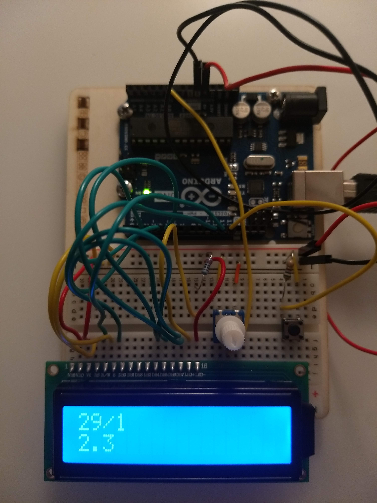
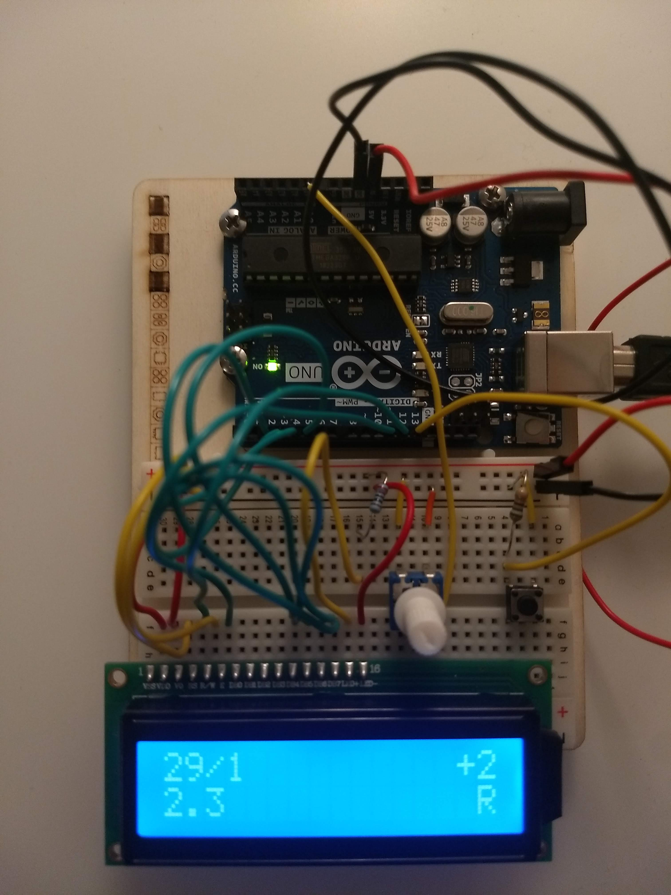
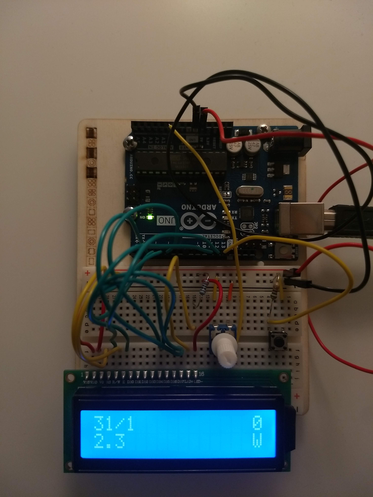
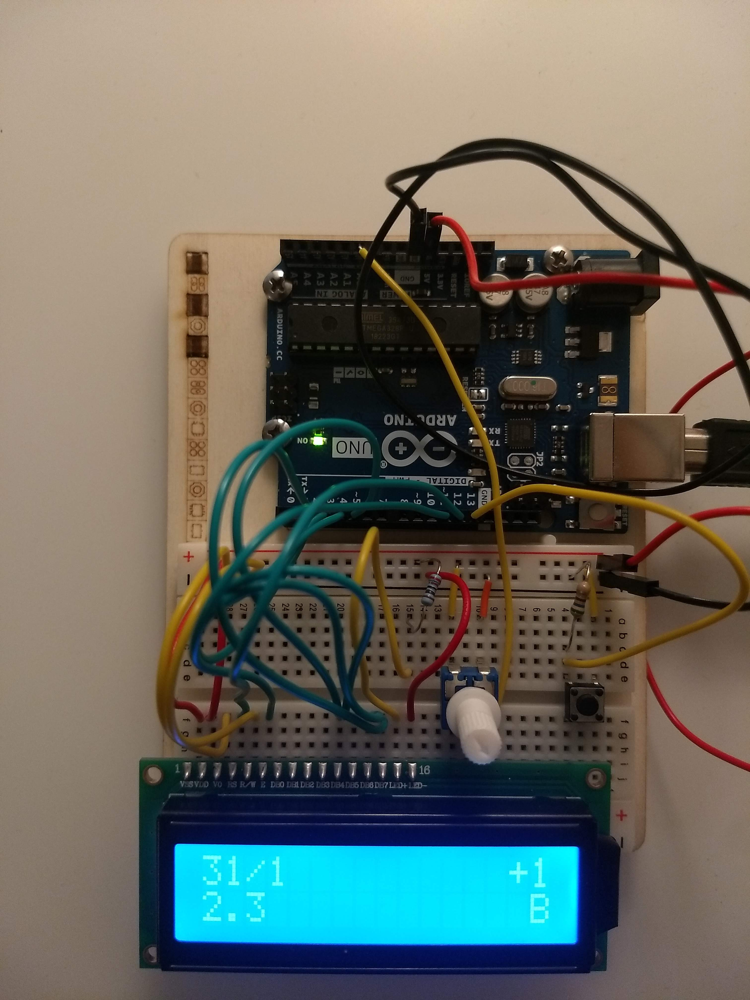

# Arduino Cricket Scoreboard
Shows runs, wickets and overs on a 16x2 LCD screen. Change between view and edit runs/wickets/balls mode with push button and add using potentiometer.
<figure>
  
  <figcaption>View mode</figcaption>
</figure>
<figure>
  
  <figcaption>Edit runs</figcaption>
</figure>
<figure>
  
  <figcaption>Edit wickets</figcaption>
</figure>
<figure>
  
  <figcaption>Edit balls</figcaption>
</figure>
